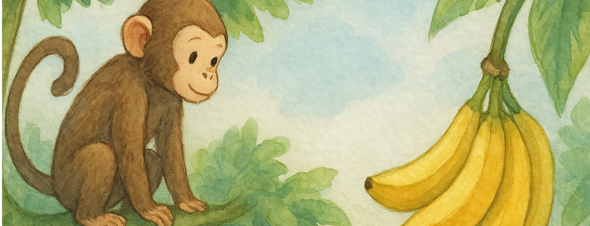

<div align="center">
    
</div>

# Estrutura de Condição e Repetição

[introdução]

## 0. O que é o "end"?

O **end** é usado para fechar blocos no Ruby. Assim, ele é utilizado para indicar onde termina:
- um método;
- uma função;
- um if;
- um loop;

> Ele seria o equivalente a: {} do Java.

## 1. Condicionais
### 📌 Definição:
Uma condicional é como quando uma pessoa precisa escolher o que fazer baseado em uma situação.
> Analogia: imagine o Macaco Chico. Ele está no alto de uma árvore e vê bananas lá embaixo. Ele só vai descer **se** tiver bananas maduras.

```ruby
tem_banana = true

if tem_banana
    puts "O Macaco Chico desce da árvore para comer!"
end
```

### If-Else - Escolhendo entre dois caminhos:

> É quando o Macaco Chico pensa: 
> - "Se tiver banana madura → comer."
> - "Se não → ficar na sombra."

```ruby
tem_banana_madura = false

if tem_banana_madura
    puts "O Macaco Chico come a banana!"
else
    puts "O Macaco Chico fica descansando."
end
```

### If-Elsif-Else - Várias possibilidades

> Agora, Chico é exigente:
> - "Se a banana estiver madura → comer."  
> - "Se estiver verde → esperar."
> - "Se não tiver banana → procurar outra árvore."

```ruby
estado_banana = "verde"

if estado_banana == "madura"
    puts "Chico come!"

elsif estado_banana == "verde"
    puts "Chico espera amadurecer."

else
    puts "Chico procura outra árvore."

end
```

### Operador Ternário (atalho)

Chico decide rápido.

```ruby
tem_banana = true
puts tem_banana ? "Chico come!" : "Chico espera."
```

> condição ? se_verdadeiro : se_falso

---


