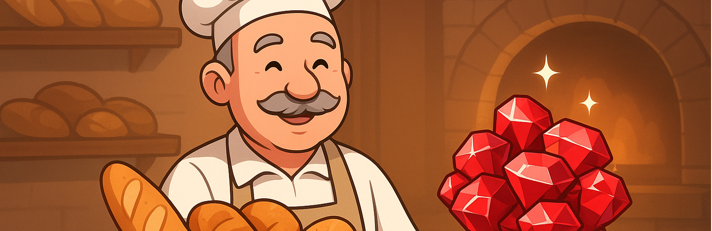

<div align="center">
  
</div>

# Arrays, Hashes e Métodos no Ruby

### Na Aula 01, você aprendeu:

- Variáveis e tipos
- Entrada e saída (gets, puts)
- Operadores
- Condicionais (if, elsif, else)
- Loops (while, until, times, each)
- break e next
- Conversão de tipos

Agora vamos para estruturas de dados mais poderosas e a criação de métodos para organizar o código.

---

## 1. Arrays (listas)
### 📌 Definição:
Um Array é como uma prateleira onde o Sr. Louis guarda pães em sequência. Cada pão está em uma posição (índice), começando no 0. Não é muito comum, mas Ruby permite que você misture dados em um array.

```ruby
pães = ["Pão francês", "Pão de queijo", "Croissant"]

puts pães[0]  # => "Pão francês"
puts pães[2]  # => "Croissant"
```

### 🧰 Operações Básicas
```ruby
pães = ["Pão francês", "Pão de queijo"]

pães << "Focaccia"            # Adiciona ao final
pães.push("Pão integral")     # Também adiciona ao final
pães.unshift("Ciabatta")      # Adiciona no início

pães.pop    # Remove o último
pães.shift  # Remove o primeiro

puts pães.length   # Quantos itens
puts pães.empty?   # Está vazio? (true/false)
```
#### Percorrendo Arrays

```ruby
pães.each do |pão|
  puts "Temos: #{pão}"

end
```
```ruby
pães.each_with_index do |pão, i|
  puts "Posição #{i}: #{pão}"

end
```

### Revisão de Arrays
| Método | O que faz |
| --- | :---: |
| .unshift | Add no início |
| .push | Add no fim |
| .shift | Remove o primeiro |
| .pop | Remove o último |
| .lenght | Vê o tamanho |
| .empty? | Vázio? |
| .each_with_index | Acessa o valor **e** o index |

---

## 2. Hashes (dicionários)
### 📌 Definição:
Um Hash é como um cardápio da padaria: cada item tem um nome (chave) e um valor (preço, por exemplo).
